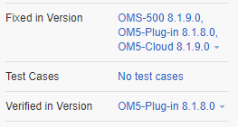
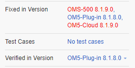

# YouTrack Builds Checker
This add-on injects JavaScript into YouTrack web pages for checking untested versions. 

Compatible with YouTrack Build *2020.2.7179* and newer.

Before add-on: 

After add-on:

## Release Notes
### v3.0.0.0
* started to support YT Lite re-designed version

### v2.0.2.0
* fixed bug: Stopped working for lower build than 200 for artificial versions from main one

### v2.0.1.0
* fixed bug: Lower build is checked as OK, when higher build is set as verified for artificial versions from main one

### v2.0.0.0
* fixed bug: Stopped working with YouTrack Build 2020.2.7179 (redesign) 

## Add-on for FireFox
[YouTrack Builds Checker](https://addons.mozilla.org/cs/firefox/addon/youtrack-builds-checker/)

## Add-on for Chrome
* download file[YouTrack Builds Checker](https://github.com/cernyjan/YouTrack-BuildsChecker/releases/)
* extract it on the file system
* open Extensions page in browser
* click the “Developer mode” checkbox to activate it
* click the “Load unpacked extension” button
* Navigate to the extension’s directory and open it