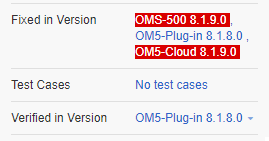

# YouTrack Builds Checker
This add-on injects JavaScript into YouTrack web pages for checking untested versions. 

Compatible with YouTrack *2018.1 Build 39916* and lower.

Before add-on: 

After add-on:

## Release Notes
### v1.0.0.1
* fixed bug: when no verified, fixed are not red 

### v1.0.0.0
* bumped version 

## Add-on for FireFox
[YouTrack Builds Checker v1.0.0.1](https://addons.mozilla.org/cs/firefox/addon/youtrack-builds-checker/)

## Add-on for Chrome
* download file [YouTrack Builds Checker v1.0.0.1](https://github.com/cernyjan/YouTrack-BuildsChecker/releases/tag/v1.0.0.1)
* extract it on the file system
* open Extensions page in browser
* click the “Developer mode” checkbox to activate it
* click the “Load unpacked extension” button
* Navigate to the extension’s directory and open it